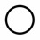

# GestureAI

[](LICENSE)

`GestureAI` is a RNN(Recurrent Nerural network) model which recognize hand-gestures drawing 5 figures(Circl, Rectangle, Triangle, Cross and the other). This dataset of hand-motion drawing 5 figures is sequences of 3-axis accelerations captured by iPhone. Example to implement RNN in Keras gets 90.8% accuracy by Cross-validation.

## Demo

Trained Neural Network deployed on [GestureAI-iOS, iOS 11 app using CoreML](https://github.com/akimach/GestureAI-iOS) :


## Get the Dataset

You can use direct links to download the dataset.

|Name|Examples|Size|Link|MD5 Checksum|
|:-:|:-:|:-:|:-:|:-:|
|`gesture-3axis-accel.tar.gz`|1,000|338 KBytes|[Download](https://github.com/akimach/GestureAI/blob/master/datasets/gesture-3axis-accel.tar.gz?raw=true)|`37664771fd60e930033fb24387fb1601 `|

## Labels

The dataset consists of 1,000 3-axis acceleration sequences of 5 gesture classes, which are defined by motions drawing 5 figures. We don't set a specific rule about stroke order for drawing a figure by hand.

|Label|Description|Examples|Figure|
|:-:|:-:|:-:|:-:|
|0|Circle|200||
|1|Rectangle|200||
|2|Triangle|200||
|3|Cross|200||
|4|Other|200||

## Requirement

* Python (2.7+)
* numpy (1.12.1+)
* protobuf (3.1.0+)
* Keras (1.2.2)
* TensorFlow (1.2.1)
* Scikit-learn (0.15+)
* coremltools (0.6.3)

## Install

```
$ virtualenv venv
$ source venv/bin/activate
$ git clone https://github.com/akimach/GestureAI.git
$ cd GestureAI
$ pip install -r requirements.txt
```

## Examples

Try with Jupyter notebook!

* Loading datasets
* Tuning hyper-parameters with Grid Search
* Training RNN with Early-stopping

## Licence

[MIT](https://github.com/akimach/GestureAI/blob/master/LICENSE)

## Author

[Akimasa KIMURA](https://github.com/akimach)
