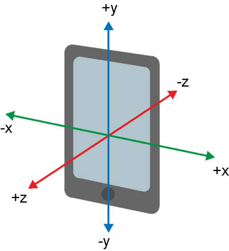

# gesture-3axis-accel Dataset

This dataset of hand-motion drawing 5 figures is sequences of 3-axis accelerations captured by iPhone for 5 seconds. Sampling rate for accelerometer is 10Hz.



## Sequence

* Input dimension : 3 dims (x, y, z)
* Max length : 40

## CSV Format

* First column : x-axis acceleration
* Second column : y-axis acceleration
* Third column : z-axis acceleration

# Extracted Directory and Files

`tar zxvf gesture-3axis-accel.tar.gz`

```
gesture-3axis-accel
├── 0 # Circle
├── 1 # Rectangle
│   ├── 1-2017-0925-00-11-11.csv
│   ├── 1-2017-0925-00-11-15.csv
│   ...
├── 2 # Triangle
├── 3 # Cross
└── 4 # Other
```

## Labels

The dataset consists of 1,000 3-axis acceleration sequences of 5 gesture classes, which are defined by motions drawing 5 figures. We don't set a specific rule about stroke order for drawing a figure by hand.

|Label|Description|Examples|Figure|
|:-:|:-:|:-:|:-:|
|0|Circle|200||
|1|Rectangle|200||
|2|Triangle|200||
|3|Cross|200||
|4|Other|200||
